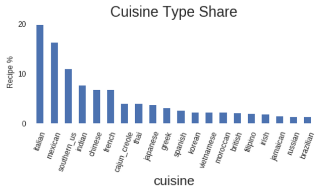
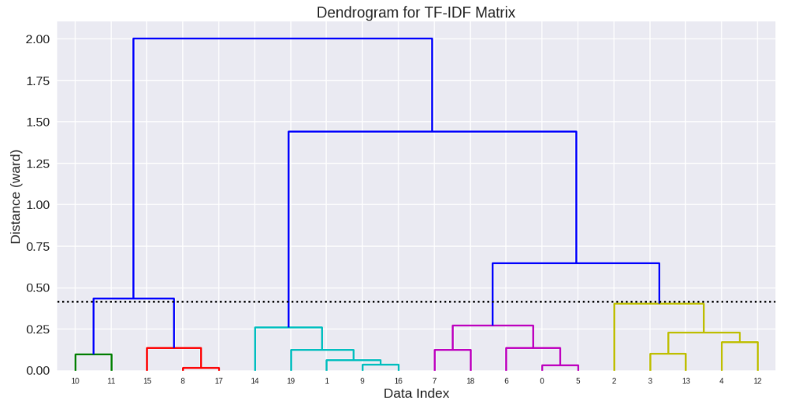
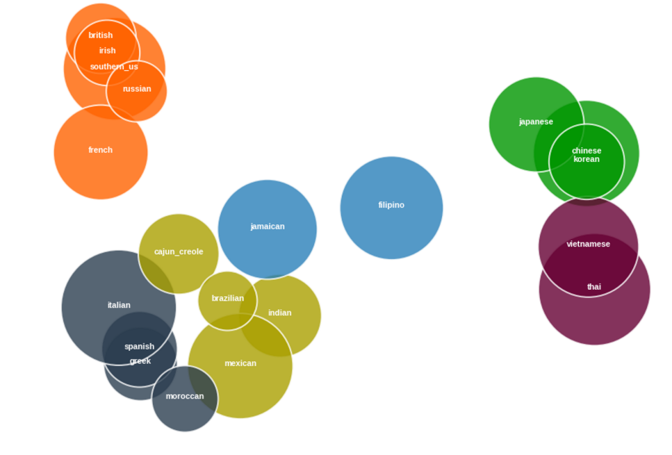

# Cuisine Recommenders Project

## Prompt

Client: **World's Best Recipe Finder**

We have a database with thousands of recipes, and we will be collecting data on which recipes users have tried. We want to implement a system that recommends recipes to users. Can you help us to not only design and create a recipe recommender, but also help us categorize different cuisine types?

Right now every recipe has and ID number, a cuisine type (e.g. Japanese, Indian, etc.), and a list of ingredients. We need to know what other data to collect to make a successful recommender, and what we can do to start making recommendations before we have a lot of user data.

## Challenge

Starting out with only recipe ingredients and cuisine type means an initial recommender is very limited. Additionally, designing and testing recommenders based on recipes users have tried requires user data that we don't have. This data had to be synthesized in a way that (at least somewhat) resembles real-life distributions &mdash; that includes recipes tried by users and any user ratings generated. Synthesizing this data from basic uniform or normal distributions would have resembled noise more than realistic user behaviors, because recipes and ratings wouldn't resemble any biases users have for certain cuisine types.

## Data

* 39,774 recipes contained in a JSON file
* Each recipe contains cuisine type, a numeric ID, and a list of ingredients

*Relative % of Cuisine Types*

## Data Processing

A binary DataFrame was created, containing recipe IDs as the index and unique ingredients for the columns. The entries were made to all contain either 0 or 1, where the latter indicates the presence of an ingredient in a given recipe. Additionally, the column names had numbers stripped from the ingredients, because some contain specific quantities that are irrelevant for the analysis.

## Exploratory Data Analysis

The first step was plotting the frequencies of ingredients for each cuisine type, to see how ingredient distributions varied between them. Following this, dimensionality reduction techniques and cluster analysis were used to determine how cuisine types could be categorized, and how those categories were influenced by each type. An important step in this analysis was the use of TF-IDF (term frequency - inverse document frequency).

*Dendrogram for TF-IDF Matrix*

Determining the number of clusters to use is an important component to this kind of unsupervised learning, and this was done using two methods: the elbow method with k-means, and agglomerative clustering. The latter determines the number of clusters using a combination of visual analysis and a statistical metric in changes of distance.

*Principal Components with Clusters and Cuisines*

Jaccard similarity was used to determine the effects of individual cuisines on their clusters, using varying cluster numbers and different dimensionality reduction techniques.

*Principal Components Clustered using k-means and Jaccard Similarity*

## First Recommender

This system was a good starting point for recommending recipes to users based on the last one they tried, and without any historical data beyond that one recipe. This type of system is content-based, because it depends only on content (recipe ingredients) and not on user histories. The approach compares all the recipes in the database to the one input (or historical record) from the user, and returns the recipes with the most similar ingredients. The measure of similarity here is cosine similarity, which is a very fast and easy metric to compute. It requires only the binary ingredients DataFrame that was created early in the analysis, and computes the angles between recipe vectors in their high-dimensional space. Smaller angles between vectors means higher similarity.

## Second Recommender

The second system required the first synthesized set of historical user data, and was a type of collaborative recommender that produces recommendations based on what recipes other users have tried, who also tried the recipe eaten by the recipient. This approach uses association rules, treating all recipes eaten by a given user as a single transaction. This approach depends only on associations, and not on user ratings.

## Third Recommender

This last system required some ratings to be synthesized and added to the already generated user data. This was another example of a collaborative system, but this example finds users with similar taste based on recipes tried and how they rated them. The similarity measure for taste uses Euclidean distance, and needed to take user rating bias into account (some users tend to rate recipes higher or lower than average).

## Business Value

Because the client is starting out with no user history, the content-based recommender is going to be a necessary first step, but it is too limited and can't provide the users with any novel recommendations.

The association rules approach works well to provide recommendations based on what recipes other users are trying, based on the recipe last tried by the user receiving a recommendation. This method requires no user ratings, and because users don't always rate things, something along this line will be a good second generation recommender for the client.

Once the client has enough user data and ratings, the third recommender or a hybrid approach will likely prove to add the most value to the users &mdash; and the client, by extension.

## Further Analysis

The approaches used in these recommenders don't have to be used separately, and the methods used in each can be varied. Here are some additional ideas to explore:

* Modify the association rules approach to use more than just single recipe antecedents (consider multiple recipes tried by a user)
* Combine the methods used in the second and third systems to provide recommendations that take ratings and associations into account
* Create a recommender that also offers a similar recipe recommendation based on similar users (a hybrid of systems 1 and 3)
